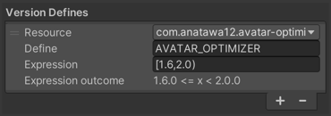

# Make your tool compatible with Avatar Optimizer

This page describes the following two things.

- When can a tool be incompatible with Avatar Optimizer?
- How to improve the compatibility?

If you have some question, please feel free to ask [`@anatawa12@misskey.niri.la` on fediverse][fediverse].

## When can a tool be incompatible with Avatar Optimizer? {#when-incompatible}

If your tool doesn't add any components to the avatar and does nothing on the build time,
your tool is already compatible with Avatar Optimizer!

If your tool adds some components to portions of the avatar, your tool can be incompatible with Avatar Optimizer.

Since Avatar Optimizer has Garbage Collection system for Components and others, Avatar Optimizer has to 
know about all existing components in the Avatar at the optimization.

To avoid problem with unknown components, Avatar Optimizer currently assumes unknown components
- have some side-effects.
- will have dependency relationship to all components referenced in the component.
  (They can be changed in the future.)

However, the assumption can be incorrect, so Avatar Optimizer will generate the following warning.


If your tool is non-NDMF[^NDMF]-based non-destructive tool that will also be applied on entering play mode,
Avatar Optimizer might be proceed before applying your plugin.

## How to improve the compatibility? {#improve-compatibility}

### For NDMF based non-destructive tools {#improve-compatibility-ndmf-based}

If your tool is a non-destructive tool based on NDMF[^NDMF], please remove your components before
Avatar Optimizer processes. Avatar Optimizer does most things in Optimization phase
so if your plugin do nothing in Optimization phase, nothing is problem.\
If your tool needs your components in Optimization phase, 
please execute before Avatar Optimizer processes with [`BeforePlugin`][ndmf-BeforePlugin]. 
QualifiedName of Avatar Optimizer in NDMF is `com.anatawa12.avatar-optimizer`.

If your tool actually wants to do something with your components in Optimization phase,
please [register your components][register-component] to Avatar Optimizer.

### For non-NDMF based non-destructive tools {#improve-compatibility-non-ndmf-based}

If your tool is a non-destructive tool not based on NDMF[^NDMF], please consider
make your tool based on NDMF.

If your tool is applied on play, to ensure compatibility with Avatar Optimizer, you have to use NDMF to
guarantee applying ordering between Avatar Optimizer and your tool.
If your tool does something only on building avatar, making your tool based on NDMF is not required.

If you don't want to make your tool based on NDMF, please remove your components before Avatar Optimizer processes.
To achieve this, your tool needs to execute before NDMF's Optimization phase.\
Current NDMF executes Optimization phase in order `-1025`, which is JUST before VRCSDK's `RemoveAvatarEditorOnly`
callback, so your tool should register `IVRCSDKPreprocessAvatarCallback` with smaller `callbackOrder`.

If your tool actually wants to do something with your components after Avatar Optimizer processes 
(Optimization phase of NDMF), please [register your components][register-component] to Avatar Optimizer.

### For other tools that just hold data with components. {#improve-compatibility-destructive-tools}

If your tool holds some information with components and has no meaning on the build time, 
please remove your components before Avatar Optimizer processes with `IVRCSDKPreprocessAvatarCallback` (see [this section](#improve-compatibility-non-ndmf-based)) 
or register your components to Avatar Optimizer (see [this section][register-component]).

### Registering your components {#register-component}

If your tool wants to keep your component after Avatar Optimizer processes, or want to removed by Avatar Optimizer,
you can register your components to Avatar Optimizer to tell about your components.

First, to call APIs of Avatar Optimizer, please make an assembly definition file[^asmdef] if your tool doesn't have.

Next, add `com.anatawa12.avatar-optimizer.api.editor` to assembly references in asmdef file.\
If your tool doesn't want to depends on Avatar Optimizer, please use [Version Defines].
Because Avatar Optimizer didn't have public API prior to 1.6.0 and will break in 2.0.0, 
it's recommended to add version range like `[1.6,2.0)`
(or stricter like `[1.7,2.0)` when you need new APIs that can be available in the future).



Then, define `ComponentInformation` for your component in your assembly.

```csharp
#if AVATAR_OPTIMIZER && UNITY_EDITOR

[ComponentInformation(typeof(YourComponent))]
internal class YourComponentInformation : ComponentInformation<YourComponent>
{
    protected override void CollectMutations(YourComponent component, ComponentMutationsCollector collector)
    {
        // call methods on the collector to tell about the component
    }

    protected override void CollectDependency(YourComponent component, ComponentDependencyCollector collector)
    {
        // call methods on the collector to tell about the component
    }
}

#endif
```

In `CollectDependency`, you should register build-time or run-time dependencies of your component.\
In `CollectMutations`, you should register any mutation your component may do.\
Please refer xmldoc and method name for more datails.

If your component is just for keeping data for your in-editor tool, both will be empty method.

[fediverse]: https://misskey.niri.la/@anatawa12
[ndmf-BeforePlugin]: https://ndmf.nadena.dev/api/nadena.dev.ndmf.fluent.Sequence.html#nadena_dev_ndmf_fluent_Sequence_BeforePlugin_System_String_System_String_System_Int32_
[register-component]: #register-component

[^asmdef]: The file defines assembly other than Assembly-CSharp. Please refer [unity docs](https://docs.unity3d.com/2019.4/Documentation/Manual/ScriptCompilationAssemblyDefinitionFiles.html).
[^NDMF]: [NDMF], Non-Destructive Modular Framework, is a framework for running non-destructive build plugins when 
building avatars by bdunderscore. Avatar Optimizer uses that framework for compatibility 
with many non-destructive tools based on NDMF.

[NDMF]: https://ndmf.nadena.dev/
[modular-avatar]: https://modular-avatar.nadena.dev/
[Version Defines]: https://docs.unity3d.com/2019.4/Documentation/Manual/ScriptCompilationAssemblyDefinitionFiles.html#define-symbols
