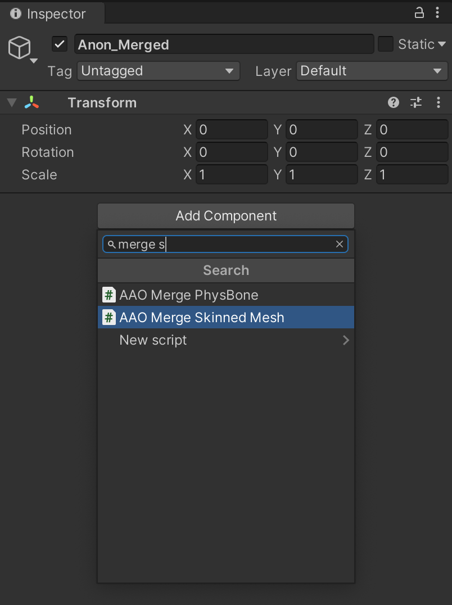

基本的な使い方
===

自動最適化を使用する {#trace-and-optimize}
---

アバターには自動的に行える最適化がいくつかあります。

- 使用していないBlendShape(シェイプキー)[^blend-shape]の削除
  - BlendShapeの値が0以外のときは処理負荷が発生するため、値をアニメーション等で変更しないBlendShapeは固定すると負荷が軽くなります。
  - 値が常に0である場合でも、固定することでアバターの容量を削減することができます。
- 使われていないPhysBone等の削除
  - 揺らす対象として存在するメッシュが常に無効になっているPhysBoneなどのように、揺らす必要のないPhysBoneが有効になっている場合は計算負荷が余分に発生してしまいます。
- アニメーションしたりPhysBoneで揺らしたりすることのないボーンの統合
  - 服のボーンを素体のボーンに入れ子状にして着せるような場合には、それ自身を動かすことがないボーンが多く発生します。そのようなボーンは余分な負荷を発生させてしまいます。

AvatarOptimizerでは、アバターのルートに`Trace And Optimize`コンポーネントを追加するだけで、これらの最適化を自動で行うことができます!

[^blend-shape]: BlendShapeはUnity上のシェイプキーの名前です。UnityやMayaではBlendShape、BlenderではShape Key、MetasequoiaやMMDではモーフと呼ばれます。

メッシュを統合してMesh Renderersを減らす {#merge-skinned-mesh}
--

Avatar Optimizerを使用すると簡単にSkinned Meshを統合することができます!
Skinned Meshを統合すると個別にオン・オフできなくなりますが、統合することで軽量化に繋がります!



**なぜSkinned Meshを統合するの?**

Skinned Meshを統合することでメッシュを変形させる処理の回数が減り、負荷が軽くなります。
また、MergeSkinnedMeshでは、同じマテリアルを使用しているマテリアルスロットも統合することができるので、描画負荷も減らす事ができます。



一番単純なパターンとして、Anonちゃんを軽量化してみます。

まず初めに、統合先のGameObjectを作りましょう。
アバターのGameObjectを右クリックから `Create Empty` をクリックして新たなGameObjectを作ります。
そうしたら、わかりやすい名前に変えておいてください。この記事では`Anon_Merged`とします。

次に、`Anon_Merged`に`Merge Skinned Mesh`コンポーネントを追加しましょう。

すると`Merge Skinned Mesh`コンポーネントと`Skinned Mesh Renderer`コンポーネントが追加されます。

`Merge Skinned Mesh`コンポーネントは、指定されたメッシュ[^mesh]を自身と一緒に付いているメッシュに統合します。

指定を楽にするために、`Anon_Merged`を選択した状態でinspectorをロックしましょう。
こうすることで複数のメッシュをまとめてドラックアンドドロップできるようになります。[^tip-lock-inspector]

それでは、顔のメッシュであるBody以外のメッシュをHierarchyで選択し、`Merge Skinned Mesh`コンポーネント内のSkinned Renderersにドラックアンドドロップで指定しましょう!



**なせ顔のメッシュは統合しないの?**

BlendShape(シェイプキー)は頂点数とBlendShape数の積に比例して重くなる処理です。
そのため、BlendShapeの数が多い顔のメッシュを頂点数の多い体のメッシュと統合するとかえって重くなってしまうため、顔は別のままにするのを推奨しています。



続いて、`Anon_Merged`の設定をしましょう！

`Merge Skinned Mesh`コンポーネントと同時に`Skinned Mesh Renrerer`が追加されています。これが統合先のメッシュになります。

`Merge Skinned Mesh`は諸事情[^merge-skinned-mesh]により、統合先のメッシュ内のボーン、メッシュ、マテリアル、BlendShape、Bounds以外の設定を自動的には行いません。
そのため、統合先のメッシュとなる`Skinned Mesh Renrerer`内の `Root Bone`, `Anchor Override`等は別途手動で設定が必要です。
`Anchor Override`には素体(BaseBody等)で用いられているものを、`Root Bone`には`Hips`を指定すると上手くいくことが多いと思います。



### UploadせずにPerformance Rankを見る方法 {#performance-rank-without-upload}

このAvatar Optimizerは非破壊改変ツールのため、VRCSDKのControl Panel上のPerformance Rankはあてにならなくなります。

その代わりにPlayモードに入った際のPerformance Rankをanatawa12's Gist PackのActual Performance Windowを使用してみられます。
詳しくは[anatawa12's Gist Packの使い方][gists-basic-usage]および[Actual Performance Windowのドキュメント][Actual Performance Window]を参照してください。

[gists-basic-usage]: https://vpm.anatawa12.com/gists/ja/docs/basic-usage/
[Actual Performance Window]: https://vpm.anatawa12.com/gists/ja/docs/reference/actual-performance-window/



[^tip-lock-inspector]: PhysBoneに複数のコライダーを指定したりするのにも使えます。色んなところで使えるので覚えておくと便利だと思います。
[^merge-skinned-mesh]: Root Bone/Anchor Overrideは等しくないと統合できないため対応予定がありません。もし良いアルゴリズムがあれば教えてください。
[^mesh]: この記事ではメッシュはUnityのMesh assetではなくSkinnedMeshRendererの意味で使用しています。

貫通防止用BlendShapeを利用してポリゴンを減らす {#remove-mesh-by-blendshape}
---

服で隠れていたりして見えないような部分のメッシュを削除すると、見た目に影響させずに描画負荷やBlendShapeの処理負荷などを減らして軽量化することができます。
これを簡単に実現するために、AvatarOptimizerでは多くの素体に含まれている貫通防止用のBlendShapeを利用してメッシュを削除することができます！

素体のメッシュに`Remove Mesh By BlendShape`コンポーネントを追加しましょう！

想定外の部位が削除されてしまわないかを確認するために`プレビューのために切り替えたBlendShapeの値を自動的に変更する`にチェックし、
削除したい部位の貫通防止用BlendShapeを下の一覧から選択しましょう！

